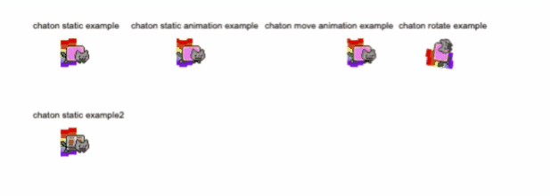

# fosfo
Petite Librairie javascript pour jeu vidéo avec canvas
 
<h2>Presentation :</h2>

 
<h2>Documentation :</h2> 

<h3>function loadimage(url) :</h3>
fosfo.loadimage preload vos images avant de démarrer votre programme ou jeu.
 
Un callback de retour et conceillier en utilisation pour attendre les chargements d'images
 
 
Exemple : 
<code>fosfo.loadimage("niam.png");</code> 
<code>fosfo.loadimage(["niam.png", "niam2.png"]).done(</code> 
<code>	function(){</code> 
<code>		//chargement terminé</code> 
<code>	}</code> 
<code>);</code>
 
<h3>function setFramesToImg(url, framewith, frameheight) :</h3>
fosfo.setFramesToImg indique a l'image d'url qu'il y a plusieurs parties d'images,
ce qui permet de pouvoir ensuite utilisé <b>fosfo.drawframe</b>.
 
url c'est l'url d'une image déja charger dans fosfo.
 
framewith correspond au nombre d'images en ligne.
 
frameheight correspond au nombre d'images sur la hauteur.
 
 
Exemple : 
<code>fosfo.drawframe("niam.png", 6, 4);</code> 

