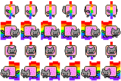

# fosfo
[![NPM version][npm-image]][npm-url]
[![build status][travis-image]][travis-url]
[![license][license-image]][license-url]
Petite Librairie javascript pour créer des jeux vidéo en canvas

## Demo :
example.html


## Installation :

````
<html>
<head>
	<script src="./fosfo.js"></script>
</head>
<body></body>
</html>
````

## Documentation :
#### Preload images :
`fosfo.loadimage` permet de charger vos images avant de démarrer votre programme.
##### Exemple :
````
let canvas = document.getElementById("cv");
let fosfo = new Fosfo(canvas);

fosfo.loadimage(["./assets/niam.png", "./assets/niam2.png"]).done(() => {
    // chargement terminé
});
````

#### Mon premier affichage :
`fosfo.draw` permet d'ajouter une image sur le canvas
##### Exemple :

````
let canvas = document.getElementById("cv");
let fosfo = new Fosfo(canvas);

fosfo.loadimage(["./assets/niam.png", "./assets/niam2.png"]).done(() => {
    // chargement terminé
	fosfo.draw("name", "miam.png", 50, 50); // fosfo.draw( nom, filename, x, y);
});
````

#### Sprite animation :
`fosfo.setFramesToImg` applique sur une image une grille de sprite qui permet l'usage de la fonction <b>fosfo.drawframe</b> pour afficher un sprite en particulier.
##### Exemple :

###### Asset de reference :
<br>

````
let canvas = document.getElementById("cv");
let fosfo = new Fosfo(canvas);

fosfo.loadimage(["./assets/niam.png", "./assets/niam2.png"]).done(() => {
    // chargement terminé
	fosfo.setFramesToImg('niam.png', 6, 4);
	fosfo.drawframe("miam1", "niam.png", 6, 4);
	
});
````

#### Drawing loop :
Loop d'affichage avec Fosfo
##### Exemple :
````
let canvas = document.getElementById("cv");
let fosfo = new Fosfo(canvas);

let loopFunction = () => {
	//TODO future code
	fosfo.draw("name", "miam.png", 50, 50);
};

fosfo.loadimage(["./assets/niam.png", "./assets/niam2.png"]).done(() => {
    // chargement terminé
	setInterval(loopFunction, fosfo.fps / 1000); // appelle la fonction loopFunction 60 fois par seconde par defaut.
});
````

#### Drawing loop avec deplacement & sprite animation :
Loop d'affichage avec Fosfo
##### Exemple :
````
let canvas = document.getElementById("cv");
let fosfo = new Fosfo(canvas);
let count = 0;

let loopFunction = () => {
	//TODO future code
	let anims = [6, 7, 8, 9, 10, 11];
	
	fosfo.undraw("chatonfou");
	fosfo.drawframe("chatonfou", 'niam.png', anims[count], 250, 60);
	
	count += 1;
	if (count >= anims.length) count = 0;
};

fosfo.loadimage(["./assets/niam.png", "./assets/niam2.png"]).done(() => {
    // chargement terminé
	setInterval(loopFunction, fosfo.fps / 1000); // appelle la fonction loopFunction 60 fois par seconde par defaut.
});
````

[npm-image]: https://img.shields.io/npm/v/samples.svg?style=flat-square
[npm-url]: https://npmjs.org/package/fosfo
[travis-image]: https://api.travis-ci.com/jguyet/fosfo.svg?branch=master
[travis-url]: https://travis-ci.com/github/jguyet/fosfo
[license-image]: https://img.shields.io/npm/l/express.svg
[license-url]: https://tldrlegal.com/license/mit-license
